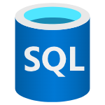

<div id="top"></div>

<!-- PROJECT SHIELDS -->
[](https://github.com/hashicorp/terraform/releases)
[](https://golang.org/)
[](https://git-scm.com/)
[](https://github.com/davivienda-colombia/davi-coe-azure-sql-module-iac/actions)


<!-- MODULE LEVEL -->

<div align="center" style="margin-top: 20px;">

  <h1 style="color: #e52b50; font-size: 36px; text-shadow: 1px 1px 2px #000000;">Module Level I</h1>

</div>

<!-- PROJECT LOGO -->

<br />
<div align="center">
  <a href="https://github.com/davivienda-colombia/davi-coe-terraform-test-lib">
    
  </a>
</div>

<br />
<div align="center">
  <a href="https://github.com/davivienda-colombia/davi-coe-terraform-test-lib">
     
  </a>
  <p align="center">
    Terraform module which creates SQL on Azure with all (or almost all) features supported for Davivienda.
    <br />
    <a href="https://github.com/davivienda-colombia/davi-coe-azure-sql-module-iac/issues">Report Bug</a>
    ·
    <a href="https://github.com/davivienda-colombia/davi-coe-azure-sql-module-iac/issues">Request Feature</a>
  </p>
</div>

### AZURE SQL Documentation

Explore comprehensive documentation on Davivienda's SQL service at our Confluence space.

[](https://davivienda-jira.atlassian.net/wiki/x/wQBeCQ)


### AZURE SQL Terraform Module


These features of SQL configurations are supported:

- SQL.


## Usage

### SQL Basic

```hcl
module "sql_basic" {
  source = "../../../../"

  create_mssql_database         = var.create_mssql_database
  create_mssql_server           = var.create_mssql_server
  resource_group_name           = azurerm_resource_group.this.name
  resource_group_location       = azurerm_resource_group.this.location
  name_mssql_server             = var.name_mssql_server
  name_mssql_database           = var.name_mssql_database
  sql_server_version            = var.sql_server_version
  public_network_access_enabled = var.public_network_access_enabled
  administrator_login           = var.administrator_login
  administrator_login_password  = var.administrator_login_password
  collation                     = var.collation
  license_type                  = var.license_type
  max_size_gb                   = var.max_size_gb
  read_scale                    = var.read_scale
  sku_name                      = var.sku_name
  zone_redundant                = var.zone_redundant
}
```

<div align="right">

  [](#Top)

</div>

## Examples:

- [SQL Basic](https://github.com/davivienda-colombia/davi-coe-azure-sql-module-iac/tree/main/examples/sql-basic) - SQL Basic (SQL Basic)

<div align="right">

  [](#Top)

</div>

<!-- BEGIN_TF_DOCS -->
## Requirements

| Name | Version |
|------|---------|
| <a name="requirement_terraform"></a> [terraform](#requirement\_terraform) | >= 1.4.0, < 2.0.0 |
| <a name="requirement_azurerm"></a> [azurerm](#requirement\_azurerm) | >= 3.5 |

## Providers

| Name | Version |
|------|---------|
| <a name="provider_azurerm"></a> [azurerm](#provider\_azurerm) | >= 3.5 |

## Modules

No modules.

## Resources

| Name | Type |
|------|------|
| [azurerm_mssql_database.this](https://registry.terraform.io/providers/hashicorp/azurerm/latest/docs/resources/mssql_database) | resource |
| [azurerm_mssql_server.this](https://registry.terraform.io/providers/hashicorp/azurerm/latest/docs/resources/mssql_server) | resource |

## Inputs

| Name | Description | Type | Default | Required |
|------|-------------|------|---------|:--------:|
| <a name="input_administrator_login"></a> [administrator\_login](#input\_administrator\_login) | The administrator login name for the new server. | `string` | `""` | no |
| <a name="input_administrator_login_password"></a> [administrator\_login\_password](#input\_administrator\_login\_password) | The password associated with the administrator user. | `string` | `""` | no |
| <a name="input_auto_pause_delay_in_minutes"></a> [auto\_pause\_delay\_in\_minutes](#input\_auto\_pause\_delay\_in\_minutes) | Time in minutes after which database is automatically paused. | `number` | `60` | no |
| <a name="input_azuread_administrator"></a> [azuread\_administrator](#input\_azuread\_administrator) | Configuration for Azure AD administrator. | `any` | `{}` | no |
| <a name="input_azuread_administrator_enabled"></a> [azuread\_administrator\_enabled](#input\_azuread\_administrator\_enabled) | Indicates whether to configure an Azure AD administrator. | `bool` | `false` | no |
| <a name="input_collation"></a> [collation](#input\_collation) | Specifies the collation of the database. | `string` | `""` | no |
| <a name="input_connection_policy"></a> [connection\_policy](#input\_connection\_policy) | The connection policy for the server. Valid values are 'Default', 'Proxy', and 'Redirect'. | `string` | `"Default"` | no |
| <a name="input_create_mode"></a> [create\_mode](#input\_create\_mode) | The creation mode of the database. Valid values are 'Default', 'Restore', 'PointInTimeRestore', 'Recovery', 'RestoreExternalBackup', 'Copy', 'OnlineSecondary', 'NonReadableSecondary', 'OnlinePrimary', 'NonReadablePrimary', 'OnlineSecondaryExternal', 'NonReadableSecondaryExternal', 'OnlinePrimaryExternal', and 'NonReadablePrimaryExternal'. | `string` | `"Default"` | no |
| <a name="input_create_mssql_database"></a> [create\_mssql\_database](#input\_create\_mssql\_database) | Controls whether to create the MSSQL database. | `bool` | `false` | no |
| <a name="input_create_mssql_server"></a> [create\_mssql\_server](#input\_create\_mssql\_server) | Controls whether to create the MSSQL server. | `bool` | `false` | no |
| <a name="input_creation_source_database_id"></a> [creation\_source\_database\_id](#input\_creation\_source\_database\_id) | The resource ID of the source database to create from. | `string` | `null` | no |
| <a name="input_elastic_pool_id"></a> [elastic\_pool\_id](#input\_elastic\_pool\_id) | The ID of the elastic pool to which to add the database. | `string` | `null` | no |
| <a name="input_enclave_type"></a> [enclave\_type](#input\_enclave\_type) | Specifies the type of enclave to be used by the elastic pool. When enclave\_type is not specified (e.g., the default) enclaves are not enabled on the database. Once enabled (e.g., by specifying Default or VBS) removing the enclave\_type field from the configuration file will force the creation of a new resource. Possible values are Default or VBS. | `string` | `null` | no |
| <a name="input_geo_backup_enabled"></a> [geo\_backup\_enabled](#input\_geo\_backup\_enabled) | boolean that specifies if the Geo Backup Policy is enabled. | `bool` | `true` | no |
| <a name="input_identity"></a> [identity](#input\_identity) | The managed identity type for the SQL server. Valid values are 'SystemAssigned', 'UserAssigned', and 'None'. | `map(any)` | `{}` | no |
| <a name="input_import"></a> [import](#input\_import) | Configuration for database import. | `any` | `[]` | no |
| <a name="input_ledger_enabled"></a> [ledger\_enabled](#input\_ledger\_enabled) | boolean that specifies if the ledger is enabled. | `bool` | `false` | no |
| <a name="input_license_type"></a> [license\_type](#input\_license\_type) | The license type to apply for this database. Valid values are 'LicenseIncluded' and 'BasePrice'. | `string` | `"LicenseIncluded"` | no |
| <a name="input_long_term_retention_policy"></a> [long\_term\_retention\_policy](#input\_long\_term\_retention\_policy) | Long-term retention policy configuration. | `any` | `[]` | no |
| <a name="input_maintenance_configuration_name"></a> [maintenance\_configuration\_name](#input\_maintenance\_configuration\_name) | The name of the Public Maintenance Configuration window to apply to the database. Valid values include SQL\_Default, SQL\_EastUS\_DB\_1, SQL\_EastUS2\_DB\_1, SQL\_SoutheastAsia\_DB\_1, SQL\_AustraliaEast\_DB\_1, SQL\_NorthEurope\_DB\_1, SQL\_SouthCentralUS\_DB\_1, SQL\_WestUS2\_DB\_1, SQL\_UKSouth\_DB\_1, SQL\_WestEurope\_DB\_1, SQL\_EastUS\_DB\_2, SQL\_EastUS2\_DB\_2, SQL\_WestUS2\_DB\_2, SQL\_SoutheastAsia\_DB\_2, SQL\_AustraliaEast\_DB\_2, SQL\_NorthEurope\_DB\_2, SQL\_SouthCentralUS\_DB\_2, SQL\_UKSouth\_DB\_2, SQL\_WestEurope\_DB\_2, SQL\_AustraliaSoutheast\_DB\_1, SQL\_BrazilSouth\_DB\_1, SQL\_CanadaCentral\_DB\_1, SQL\_CanadaEast\_DB\_1, SQL\_CentralUS\_DB\_1, SQL\_EastAsia\_DB\_1, SQL\_FranceCentral\_DB\_1, SQL\_GermanyWestCentral\_DB\_1, SQL\_CentralIndia\_DB\_1, SQL\_SouthIndia\_DB\_1, SQL\_JapanEast\_DB\_1, SQL\_JapanWest\_DB\_1, SQL\_NorthCentralUS\_DB\_1, SQL\_UKWest\_DB\_1, SQL\_WestUS\_DB\_1, SQL\_AustraliaSoutheast\_DB\_2, SQL\_BrazilSouth\_DB\_2, SQL\_CanadaCentral\_DB\_2, SQL\_CanadaEast\_DB\_2, SQL\_CentralUS\_DB\_2, SQL\_EastAsia\_DB\_2, SQL\_FranceCentral\_DB\_2, SQL\_GermanyWestCentral\_DB\_2, SQL\_CentralIndia\_DB\_2, SQL\_SouthIndia\_DB\_2, SQL\_JapanEast\_DB\_2, SQL\_JapanWest\_DB\_2, SQL\_NorthCentralUS\_DB\_2, SQL\_UKWest\_DB\_2, SQL\_WestUS\_DB\_2, SQL\_WestCentralUS\_DB\_1, SQL\_FranceSouth\_DB\_1, SQL\_WestCentralUS\_DB\_2, SQL\_FranceSouth\_DB\_2, SQL\_SwitzerlandNorth\_DB\_1, SQL\_SwitzerlandNorth\_DB\_2, SQL\_BrazilSoutheast\_DB\_1, SQL\_UAENorth\_DB\_1, SQL\_BrazilSoutheast\_DB\_2, SQL\_UAENorth\_DB\_2. Defaults to SQL\_Default. | `string` | `null` | no |
| <a name="input_max_size_gb"></a> [max\_size\_gb](#input\_max\_size\_gb) | The max size of the database expressed in bytes. | `number` | `2` | no |
| <a name="input_min_capacity"></a> [min\_capacity](#input\_min\_capacity) | The minimum capacity of the database. | `number` | `1` | no |
| <a name="input_minimum_tls_version"></a> [minimum\_tls\_version](#input\_minimum\_tls\_version) | The minimum TLS version for the server. Valid values are '1.0', '1.1', and '1.2'. | `string` | `"1.2"` | no |
| <a name="input_name_mssql_database"></a> [name\_mssql\_database](#input\_name\_mssql\_database) | The name of the MSSQL database. | `string` | `""` | no |
| <a name="input_name_mssql_server"></a> [name\_mssql\_server](#input\_name\_mssql\_server) | The name of the MSSQL server. Must be unique within Azure. | `string` | `""` | no |
| <a name="input_outbound_network_restriction_enabled"></a> [outbound\_network\_restriction\_enabled](#input\_outbound\_network\_restriction\_enabled) | Whether outbound network traffic is restricted for this server. | `bool` | `false` | no |
| <a name="input_public_network_access_enabled"></a> [public\_network\_access\_enabled](#input\_public\_network\_access\_enabled) | Indicates whether public network access is allowed for the server. | `bool` | `false` | no |
| <a name="input_read_replica_count"></a> [read\_replica\_count](#input\_read\_replica\_count) | The number of read replicas for the database. | `number` | `0` | no |
| <a name="input_read_scale"></a> [read\_scale](#input\_read\_scale) | The read scale of the database. | `string` | `"Disabled"` | no |
| <a name="input_recover_database_id"></a> [recover\_database\_id](#input\_recover\_database\_id) | The resource ID of the database to recover. | `string` | `""` | no |
| <a name="input_resource_group_location"></a> [resource\_group\_location](#input\_resource\_group\_location) | The Azure location where the resource will exist. | `string` | n/a | yes |
| <a name="input_resource_group_name"></a> [resource\_group\_name](#input\_resource\_group\_name) | The name of the resource group where the MSSQL server will be created. | `string` | n/a | yes |
| <a name="input_restore_dropped_database_id"></a> [restore\_dropped\_database\_id](#input\_restore\_dropped\_database\_id) | The resource ID of the database to restore. | `string` | `""` | no |
| <a name="input_restore_point_in_time"></a> [restore\_point\_in\_time](#input\_restore\_point\_in\_time) | The point in time to restore the database to. | `string` | `""` | no |
| <a name="input_sample_name"></a> [sample\_name](#input\_sample\_name) | Specifies the name of the sample schema to apply when creating this database. | `string` | `null` | no |
| <a name="input_secondary_type"></a> [secondary\_type](#input\_secondary\_type) | How do you want your replica to be made? Valid values include Geo and Named. | `string` | `"Geo"` | no |
| <a name="input_short_term_retention_policy"></a> [short\_term\_retention\_policy](#input\_short\_term\_retention\_policy) | Short-term retention policy configuration. | `any` | `[]` | no |
| <a name="input_sku_name"></a> [sku\_name](#input\_sku\_name) | Specifies the name of the SKU used by the database. For example, GP\_S\_Gen5\_2,HS\_Gen4\_1,BC\_Gen5\_2, ElasticPool, Basic,S0, P2 ,DW100c, DS100. | `string` | `"GP_Gen5_2"` | no |
| <a name="input_sql_server_version"></a> [sql\_server\_version](#input\_sql\_server\_version) | The version of the MSSQL server. Valid values are: 2.0 and 12.0. | `string` | `"12.0"` | no |
| <a name="input_storage_account_type"></a> [storage\_account\_type](#input\_storage\_account\_type) | Specifies the storage account type used to store backups for this database. Possible values are Geo, GeoZone, Local and Zone. | `string` | `"Local"` | no |
| <a name="input_threat_detection_policy"></a> [threat\_detection\_policy](#input\_threat\_detection\_policy) | Threat detection policy configuration. | `any` | `[]` | no |
| <a name="input_transparent_data_encryption_enabled"></a> [transparent\_data\_encryption\_enabled](#input\_transparent\_data\_encryption\_enabled) | If set to true, Transparent Data Encryption will be enabled on the database. If set to false, Transparent Data Encryption will be disabled on the database. | `bool` | `null` | no |
| <a name="input_transparent_data_encryption_key_automatic_rotation_enabled"></a> [transparent\_data\_encryption\_key\_automatic\_rotation\_enabled](#input\_transparent\_data\_encryption\_key\_automatic\_rotation\_enabled) | Boolean flag to specify whether TDE automatically rotates the encryption Key to latest version or not. Possible values are true or false. | `bool` | `null` | no |
| <a name="input_transparent_data_encryption_key_vault_key_id"></a> [transparent\_data\_encryption\_key\_vault\_key\_id](#input\_transparent\_data\_encryption\_key\_vault\_key\_id) | The fully versioned Key Vault Key URL (e.g. 'https://<YourVaultName>.vault.azure.net/keys/<YourKeyName>/<YourKeyVersion>) to be used as the Customer Managed Key(CMK/BYOK) for the Transparent Data Encryption(TDE) layer. | `string` | `null` | no |
| <a name="input_zone_redundant"></a> [zone\_redundant](#input\_zone\_redundant) | Whether or not this database is zone redundant, which means the replicas of this database will be spread across multiple availability zones. This property is only settable for Premium and Business Critical databases. | `bool` | `false` | no |

## Outputs

| Name | Description |
|------|-------------|
| <a name="output_mssql_database_id"></a> [mssql\_database\_id](#output\_mssql\_database\_id) | The ID of the MSSQL Database. |
| <a name="output_mssql_server_fqdn"></a> [mssql\_server\_fqdn](#output\_mssql\_server\_fqdn) | The fully qualified domain name of the MSSQL Server. |
| <a name="output_mssql_server_id"></a> [mssql\_server\_id](#output\_mssql\_server\_id) | The ID of the MSSQL Server. |
<!-- END_TF_DOCS -->

<div align="right">

  [](#Top)

</div>

## Mantainers
Module is maintained by  [COE Arquitectura Cloud](https://github.com/orgs/davivienda-colombia/teams/arqs-team)

### Authors
- Cristhian Jhael Robayo Arbelaez [cristhian-robayo_davicode](https://github.com/cristhian-robayo_davicode)


Please add here if you made a contribution
<div align="right">

  [](#Top)

</div>
